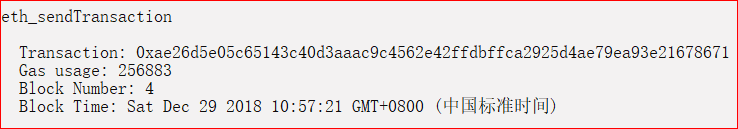

[TOC]

### 选题背景与依据

选题背景：我在了解了区块链的去中心化以及不可篡改性后，我就想到了版权保护以及用户信息保护等等的这些。<br>
现在版权保护是音乐、视频等方面的痛点，也是关键点，不知道有多少盗版正在摧毁歌手们的创作热情。<br>
用户隐私也是，即使是一些大公司，如facebook，都可能会有用户隐私暴露这方面的问题，这可是对正常人隐私权的极大侵犯。
所以，我们可以利用区块链自身的特性来非常简单的实现即去中心化又可保护版权的音乐播放器。<br>
最后我选择实现区块链版本的音乐播放器。一些具体设想如下：

- 可以利用区块链的地址进行注册(我这里使用的是测试链，是用ganache-cli弄出来的，所以只用地址就可以注册了，不需要像geth控制台一样用私钥来解锁)；
- 每个用户都可上传和下载音乐，可以查看他人发布的音乐，还可以用区块链的货币进行音乐交易；
- 区块链的不可篡改性，用于保护音乐的版权；

(但由于时间因素(临近期末考)以及对区块链的了解程度，我没有很好的实现，甚至连音乐播放都还未实现，最大的收获反而是加深了对网页前后端的了解。。。)

### 使用说明

#### 目录结构


其中只有部分是非常有用的，我来简单介绍一下(其实这样的目录结构好像有点问题)：

- client文件夹：发送到前端的文件，包括css文件、js文件。
	- css文件夹：里面只有index.css是总的css文件，所有用index.pug模板派生出来到。
	- js文件夹：前端需要的js文件。其中login.js负责注册和登陆的逻辑；main.js负责主页面的逻辑；upload.js负责上传音乐文件页面的逻辑。
- server文件夹：后台文件。
	- app文件夹：真正的后台逻辑文件存放的地方，其中app.js是负责主要逻辑的，而deploy.js负责合约部署的，但app.js会自动调用deploy。
	- constracts文件夹：存放合约文件的地方，这里只有一个控制音乐逻辑的合约——MusicContract.sol。
	- upload文件夹：存放上传的音乐文件的地方(其实如果用mongoose或者ipfs来存储会更好，但是由于时间因素，以后再完善吧)。
	- views文件夹：存放用于渲染出html页面的pug文件。index.pug是主要的三个页面的基础，根据条件导入各个文件；login.pug用于渲染登陆/注册界面；
		main.pug用于渲染主页面；upload.pug用于渲染上传页面。

#### 运行

先在一个命令行窗口运行``ganache-cli``指令(先需要``npm install ganache-cli``)。<br>
然后进入到server文件夹下的app文件夹中，在另一个命令行用``node app.js``来启动这个应用，之后就可以通过http://localhost:3000/来进行访问。<br>
可以访问到三个页面：login、main以及upload。

#### login页面

- login功能<br>
	
- register功能<br>
	

改进：应该在main中使用弹出窗口来代替login页面的一起的，甚至其实login和upload页面都是不需要的，只要在main中用弹出框或者分页导航那样，只要一个main页面就行了。

#### main页面

- 正在播放：查看自己拥有的音乐，包括自己发布的和购买的，而且可以下载；
	<br>
- 所有歌曲：向后台请求数据，进而一次最多获得6个用户发布的前3首歌的信息，以卡片形式展示，点击每个卡片才会像后台请求这个用户的所有歌曲以列表形式展示，
	然后就可以购买这些歌了，当然得依据你的余额；先来看看卡片形式的信息：
	<br><br>
	然后再来看看点击了卡片后进入的音乐列表吧：
	<br>
- 歌曲搜索：功能暂未实现；
	<br>
- 上传歌曲：跳转到上传歌曲的页面；
- 修改个人信息：能够修改用户的昵称、描述以及进行充钱活动。
	<br>

#### upload页面

可以填写很多信息，其中必需的是音乐名、音乐描述以及上传的音乐文件。
而音乐tag可以选择已有的，或者新增自定义的，自定义的这些会被收录，在接下来访问upload时会添加到已有的里面。
<br>

### 测试检验

#### 注册与登陆

这两者都是以post形式提交到后台的，而且都会在登陆后附加一个user_address称呼的session来保证会话：
访问的用户没有这个session的话，那么无论他访问http://localhost:3000的哪一个页面，后台都会返回login页面。
```js
<!-- 检测 -->
app.use(function (req, res, next) {
    console.log(req.session);
    if ((!req.session["user_address"] && req.url != "/login") || !checkAddress(req.session["user_address"])) res.redirect("/login");
    else next();
});
<!-- 注册与登陆 -->
app.post("/login", (req, res) => {
    console.log("post /login");
    let { username, registeraddress, userdesc, loginaddress } = req.body;
    let isRegister = typeof loginaddress == "undefined";
    let using_address = isRegister ? registeraddress : loginaddress;
    // 验证地址：必须是数字且在合法的10个测试账号里面
    if (!checkAddress(using_address)) res.status(500).send({ code: 500, data: [], msg: 'invalid address!' });
    // 登陆
    if (!isRegister) {
        if (contractInstance.users(loginaddress)[0] == '0x0000000000000000000000000000000000000000') {
            console.log(loginaddress + "还没有注册！");
            res.status(400).send({ code: 400, data: [], msg: 'not yet registered!' });
        } else {
            console.log(loginaddress + "成功登陆了！");
            req.session["user_address"] = loginaddress;
            res.status(200).send({ code: 200, data: [], msg: 'login successful!' });
        }
        return;
    }
    // 注册
    if (contractInstance.users(registeraddress)[0] == '0x0000000000000000000000000000000000000000') {
        contractInstance.createUser(username, userdesc, [], [], {
            from: registeraddress,
            value: 0,
            gas: 200000
        });
        console.log(registeraddress + "成功注册了！");
        req.session["user_address"] = registeraddress;
        res.status(200).send({ code: 200, data: [], msg: 'register successful!' });
    } else {
        console.log(registeraddress + "已经注册了！");
        res.status(400).send({ code: 400, data: [], msg: 'already registered!' });
    }
});
```
<br>
<br>

#### 上传歌曲

上传音乐也是利用到了合约的交易的：注册音乐信息，保护音乐版权。
<br>
<br>
<br>

#### 显示歌曲

显示自己已有的歌曲，包括自己上传的与购买别人的。
<br><br>
或者显示其他歌手的部分歌曲。
<br><br>
或者显示某个歌手的所有歌曲
<br><br>

#### 充钱

<br>

#### 歌曲交易

<br>
<br>
<br>